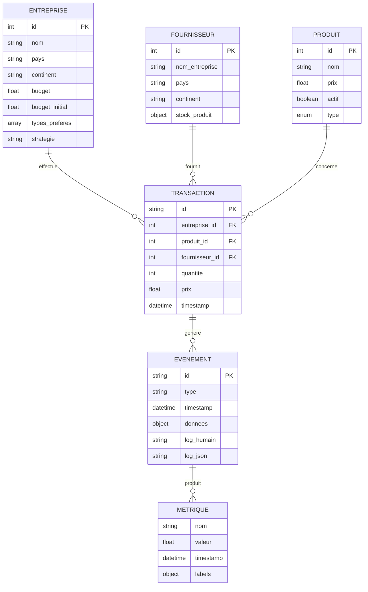
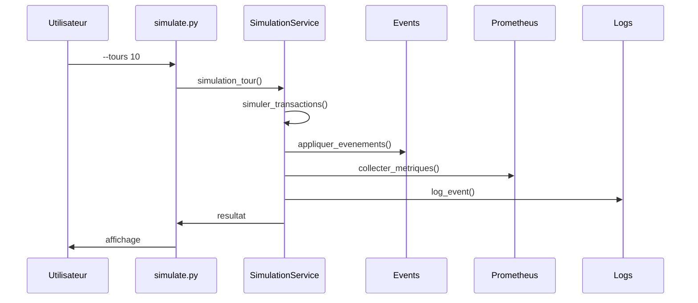
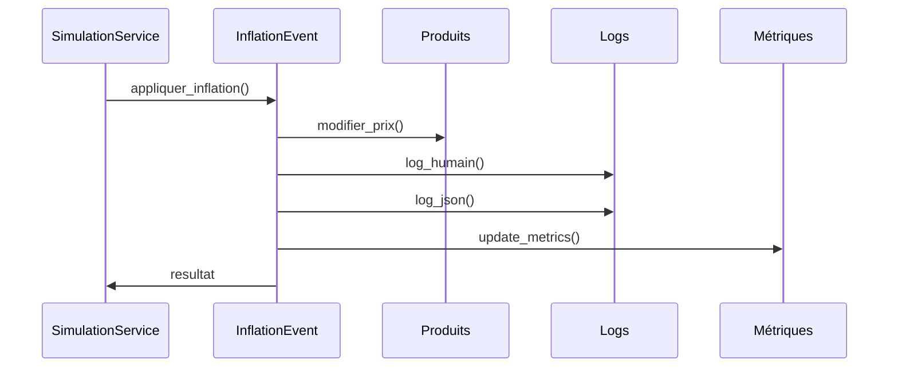
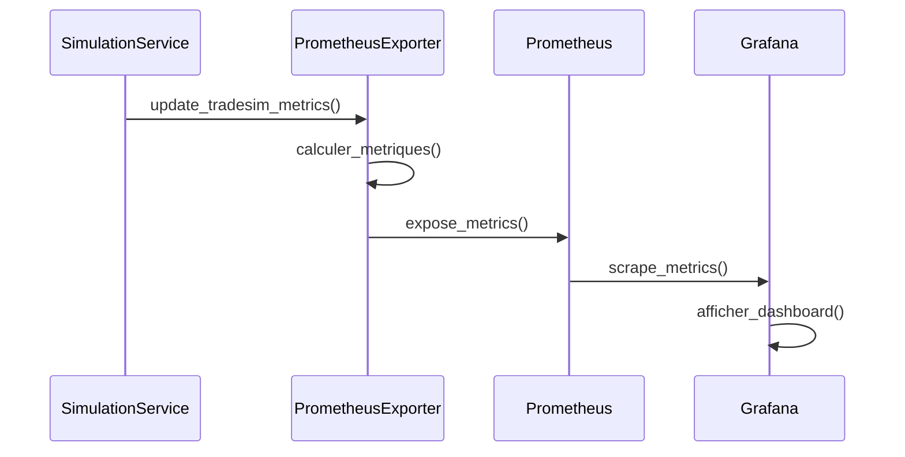

# 📋 CAHIER DES CHARGES DÉTAILLÉ - TRADESIM

## 🎯 **PÉRIMÈTRE**

### **✅ DANS LE PÉRIMÈTRE (implémenté) :**
- Simulation économique CLI complète
- Événements dynamiques (inflation, recharge, reassort)
- Monitoring Prometheus (collecte métriques)
- Logging structuré (JSON + humain)
- Tests unitaires et intégration
- Configuration centralisée
- Pattern Repository
- Thread-safety et cache optimisé

### **❌ HORS PÉRIMÈTRE (non implémenté) :**
- Dashboards Grafana
- Interface Web fonctionnelle
- Base de données persistante
- Authentification/autorisation
- Déploiement Cloud
- CICD automatisé
- Monitoring avancé (alertes, traces)

## 📊 **FONCTIONNALITÉS DÉTAILLÉES**

### **🔄 Simulation économique**

#### **Description :**
Simulation de transactions entre entreprises et fournisseurs avec événements dynamiques.

#### **Flux utilisateur :**
1. Lancement CLI avec paramètres
2. Initialisation données (entreprises, fournisseurs, produits)
3. Exécution tours de simulation
4. Application événements aléatoires
5. Collecte métriques
6. Affichage résultats

#### **Critères d'acceptation :**
- ✅ Transactions effectuées entre entités
- ✅ Événements appliqués selon probabilités
- ✅ Métriques collectées en temps réel
- ✅ Logs structurés générés
- ✅ Performance stable sous charge

#### **Dépendances :**
- `services/simulation_service.py` (lignes 898-996)
- `config/config.py` (paramètres simulation)
- `models/models.py` (entités)
- `events/` (événements)

### **📈 Événements dynamiques**

#### **Inflation :**
- **Fichier** : `events/inflation.py`
- **Fonction** : Variation des prix des produits
- **Critères** : Prix modifiés, logs générés

#### **Recharge budget :**
- **Fichier** : `events/recharge_budget.py`
- **Fonction** : Ajout de budget aux entreprises
- **Critères** : Budget augmenté, logs générés

#### **Reassort :**
- **Fichier** : `events/reassort.py`
- **Fonction** : Réapprovisionnement des stocks
- **Critères** : Stocks augmentés, logs générés

#### **Variation disponibilité :**
- **Fichier** : `events/variation_disponibilite.py`
- **Fonction** : Changement de disponibilité des produits
- **Critères** : Disponibilité modifiée, logs générés

### **📊 Monitoring**

#### **Prometheus :**
- **Fichier** : `monitoring/prometheus_exporter.py`
- **Fonction** : Collecte métriques temps réel
- **Critères** : Métriques exposées sur `/metrics`

#### **Grafana :**
- **Statut** : ❌ Non implémenté
- **Fonction** : Visualisation des métriques
- **Critères** : Dashboards créés et fonctionnels

## 🖥️ **INTERFACES**

### **💻 CLI**

| Commande | Description | Options | Exemples | Codes sortie |
|----------|-------------|---------|----------|--------------|
| `--new-game` | Nouvelle partie | - | `python simulate.py --new-game` | 0 (succès) |
| `--tours N` | Simulation N tours | N (int) | `python simulate.py --tours 10` | 0 (succès) |
| `--infinite` | Simulation infinie | - | `python simulate.py --infinite` | 0 (succès) |
| `--with-metrics` | Avec monitoring | - | `python simulate.py --tours 5 --with-metrics` | 0 (succès) |
| `--verbose` | Affichage détaillé | - | `python simulate.py --tours 3 --verbose` | 0 (succès) |

#### **Format d'entrée/sortie :**
- **Entrée** : Arguments ligne de commande
- **Sortie** : Texte formaté + logs fichiers
- **Codes erreur** : 0 (succès), 1 (erreur)

### **🌐 API Web**

#### **Serveur :**
- **Framework** : FastAPI
- **Fichier** : `api/main.py`
- **Port** : 8000 (par défaut)

#### **Routes détectées :**
| Route | Méthode | Description | Statut |
|-------|---------|-------------|--------|
| `/metrics` | GET | Métriques Prometheus | ✅ Implémenté |
| `/health` | GET | Health check | ❓ À vérifier |
| `/api/simulation` | POST | Lancement simulation | ❓ À vérifier |

#### **Schémas :**
```python
# SimulationRequest
{
    "tours": int,
    "verbose": bool,
    "with_metrics": bool
}

# SimulationResponse
{
    "status": str,
    "result": dict,
    "metrics": dict
}
```

## 🗄️ **MODÈLE DE DONNÉES**



## 🔄 **FLUX CLÉS**

### **Simulation CLI :**


### **Événement inflation :**


### **Monitoring Prometheus :**


## ⚡ **EXIGENCES NON FONCTIONNELLES**

### **🚀 Performance :**
- **Temps de réponse** : < 1s par tour de simulation
- **Mémoire** : < 100MB pour simulation standard
- **CPU** : < 50% utilisation moyenne
- **Cache** : Invalidation toutes les 1s (thread-safe)

### **🔒 Sécurité :**
- **Validation** : Toutes les entrées validées (Pydantic)
- **Logs** : Pas de données sensibles dans les logs
- **API** : Validation des requêtes HTTP (si implémenté)

### **📊 Observabilité :**
- **Logs** : Niveau INFO, ERROR, DEBUG
- **Métriques** : Collecte toutes les 1s
- **Traçabilité** : IDs uniques pour transactions
- **Corrélation** : Session ID pour regroupement

### **🔄 Scalabilité :**
- **Thread-safety** : Accès concurrent sécurisé
- **Cache** : Optimisation mémoire
- **Modularité** : Services indépendants

## 🔧 **CONTRAINTES & HYPOTHÈSES**

### **Contraintes techniques :**
- **Python 3.8+** : Langage de développement
- **Prometheus** : Système de monitoring
- **FastAPI** : Framework Web (si implémenté)
- **Pydantic** : Validation des données

### **Contraintes fonctionnelles :**
- **CLI prioritaire** : Interface principale
- **Monitoring temps réel** : Métriques continues
- **Logs structurés** : JSON + humain

### **Hypothèses :**
- **Données en mémoire** : Mode CLI
- **Base de données** : Mode Web (futur)
- **Monitoring local** : Prometheus/Grafana
- **Déploiement** : Cloud (futur)

## 📋 **CRITÈRES D'ACCEPTATION**

### **Fonctionnels :**
- ✅ Simulation exécute sans erreur
- ✅ Événements appliqués selon probabilités
- ✅ Métriques collectées et exposées
- ✅ Logs générés dans les deux formats
- ✅ Tests unitaires passent

### **Non fonctionnels :**
- ✅ Performance stable sous charge
- ✅ Thread-safety garantie
- ✅ Cache optimisé
- ✅ Validation des données
- ✅ Documentation complète

### **Monitoring :**
- ❌ Dashboards Grafana créés
- ❌ Métriques à zéro investiguées
- ❌ Tests de monitoring complets
- ❌ Alertes configurées

---
**Auteur** : Assistant IA  
**Date** : 11/08/2025  
**Version** : 1.0 - Basé sur l'état actuel du code
